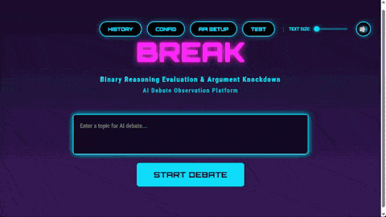

# BREAK - Binary Reasoning Evaluation & Argument Knockdown

**AI議論プラットフォーム**


## 🎬 デモ



2つのAIが対立軸を定めて議論し、Judge AIが勝敗を判定します。

---

## 📖 何ができるか

BREAKは、**2つのAIが対立軸を定めて議論**し、Judge AIが勝敗を判定するAI議論観察プラットフォームです。

### 主な特徴

- **21種類の対立軸**: 倫理・技術・健康・政策・人間関係・キャリア・規制の7カテゴリー、各3軸
- **2ラウンド制議論**: Round 1で主張・根拠・先制反論、Round 2で反論・最終声明
- **BREAK SHOT**: 議論の決定的瞬間を特定（最高評価の発言を抽出）
- **多次元スコアリング**: LOGIC・ATTACK・CONSTRUCT の3軸でAIを評価（各0-10点）
- **SYNTHESIS**: 議論全体を俯瞰した統合的見解を生成
- **複数エンジン対応**: Gemini API、Claude Code、OpenRouter、Ollama など6種類
- **履歴管理**: 過去の議論をデータベースに保存

### 議論の仕組み

BREAKでは、以下のフローで議論が進行します。

**議論フロー**:
1. **Axis Determination**: Judgeが21軸から最適な対立軸を選定
2. **Round 1**: AI_A/AI_Bが並列で主張・根拠・先制反論を展開
3. **Round 2**: AI_A/AI_Bが並列で反論・最終声明を展開
4. **Final Judgment**: Judgeが3軸スコアリング（LOGIC 40%、ATTACK 30%、CONSTRUCT 30%）で勝敗判定
5. **BREAK SHOT**: 最も評価の高かった発言を特定
6. **SYNTHESIS**: 議論全体の統合的見解を生成

### 使用例

- 「AIによる雇用代替は社会にとって良いことか？」
  → 対立軸: **効率重視 ⚔️ 公平重視**

- 「リモートワークは全社導入すべきか？」
  → 対立軸: **生産性優先 ⚔️ コミュニケーション優先**

- 「原子力発電は再稼働すべきか？」
  → 対立軸: **リスク許容 ⚔️ リスク回避**

---

## ⚠️ 前提条件

このツールを動かすには以下いずれかが必要です。

- **Gemini APIキー**利用可能（無料～）
- **Gemini CLI**利用可能（無料～）
- **Claude Code**利用可能プラン契約済み（月額$20～）
- **ChatGPT Plus**以上でCodex CLI利用可能（月額$20〜）
- **OpenRouter APIキー**利用可能(有料、モデルは一部無料あり)
- **Ollamaサーバ**利用可能(対応モデルダウンロード必要)

これらを準備できる方は多くないことは理解しています。
実験的なプロジェクトとして楽しんでいただければ幸いです。

## 🚀 セットアップ

### 動作確認済み環境

- **OS**: Ubuntu 24.04 LTS、Windows 11
   - WSL、MacOSは動作未確認です（動く可能性はあります）
- **Python**: 3.11以上（開発環境: Python 3.13.5）
- **ブラウザ**: Chrome, Edge (最新版推奨)

**その他の要件**:
- Git インストール済み
- Python 3.11以上

### ⚡ クイックスタート

#### 前提条件
- **Git** インストール済み
- **Python 3.11以上** インストール済み

#### 1. APIキー取得（Gemini APIを使う場合）
1. https://aistudio.google.com/apikey にアクセス
2. 「Create API Key」をクリック
3. APIキーをコピー（後で使います）

#### 2. セットアップ
```bash
# リポジトリをクローン
git clone https://github.com/yo2158/break.git
cd break

# 仮想環境作成（推奨）
python3 -m venv venv  # Windows: python -m venv venv
source venv/bin/activate  # Windows: venv\Scripts\activate

# 依存パッケージをインストール
pip install -r requirements.txt

# .envファイルを作成
cp .env.example .env

# .envファイルを編集してAPIキーを設定
nano .env  # または任意のエディタ
```

**.envファイルの編集例**:
```
GEMINI_API_KEY=AIza...（あなたのAPIキー）
OPENROUTER_API_KEY=sk-or-v1-...（使う場合）
OLLAMA_URL=http://localhost:11434（Ollama使う場合）
```

#### 3. サーバー起動
```bash
python -m backend.app
```

#### 4. ブラウザでアクセス

ブラウザで http://localhost:5000 を開く

#### 5. AIエンジン設定

1. 画面右上の 「CONFIG」 をクリック
2. AI_A、AI_B、Judgeのエンジンとモデルを選択
   - デフォルト: 全て Gemini API (gemini-2.5-flash)
3. 「SAVE CONFIG」 をクリック

#### 6. 接続テスト

1. 「TEST」 ボタンをクリック
2. 「RUN CONNECTION TEST」 をクリック
3. 全て ✅ SUCCESS になることを確認

#### 7. 実行

1. トピックを入力（例: 「リモートワークを全社導入すべきか？」）
2. 「START DEBATE」 をクリック
3. 議論の進行を観察:
   - **Analyzing**: 対立軸を決定中
   - **ROUND 1**: 両者の主張を展開
   - **ROUND 2**: 反論と最終声明
   - **FINAL JUDGMENT**: 勝敗判定とBREAK SHOT表示

---

## 🎭 エンジン構成の柔軟性

BREAKでは、AI_A、AI_B、Judgeに**異なるエンジン**を設定できます。

### 組み合わせ例

- **Gemini vs Claude** (Judge: Gemini)
  ```
  AI_A: Gemini API (gemini-2.5-flash)
  AI_B: Claude (claude-sonnet-4.5)
  Judge: Gemini CLI (gemini-2.5-flash)
  ```

- **API vs CLI対決** (Judge: OpenRouter)
  ```
  AI_A: Gemini API (gemini-2.5-pro)
  AI_B: Claude Code (claude-sonnet-4.5)
  Judge: OpenRouter (anthropic/claude-sonnet-4.5)
  ```

- **ローカルAI対決** (Judge: Gemini API)
  ```
  AI_A: Ollama (gemma3:12b)
  AI_B: Ollama (gpt-oss:latest)
  Judge: Gemini API (gemini-2.5-flash)
  ```
---

## ⚠️ 注意事項

### AI議論の精度について

- 2つのAIが生成する議論は自動生成されます
- 議論結果はあくまで**知的エンターテインメント**としてご利用ください
- 実際の意思決定には専門家の判断を仰いでください

### コストについて

- **Gemini API**: 無償枠はあるものの設定によっては有料となる点に注意
- **Claude Code**: Claude Pro/Team/API課金が必要
- **Gemini CLI**: 個人Googleアカウントで無料利用可能（1日1000リクエストまで）
- **Codex CLI**: ChatGPT Plus以上が必要
- **OpenRouter**: 基本有料のクレジット購入でのAPIキー作成が前提
- **Ollama**: 無料だがGPU推奨（CPU動作は遅い）

各サービスの利用規約と料金プランは公式サイトでご確認ください。

### APIキーの保存について

**重要: セキュリティに関する注意事項**

BREAKでは、API設定画面から入力されたAPIキーを、ローカル環境の `.env` ファイルに**平文（暗号化されていないテキスト）** で保存します。

**BREAKはローカル環境での個人利用を想定して設計されています。本番環境での使用は推奨しません。**

### 免責事項

このツールの議論結果について、開発者は一切の責任を負いません。

---

## 📁 プロジェクト構造

```
break/
├── backend/              # バックエンド
│   ├── app.py            # Flaskアプリケーション
│   ├── debate_engine.py  # 議論エンジン
│   ├── prompt_builder.py # プロンプト生成
│   ├── axis_patterns.py  # 対立軸定義
│   ├── db_manager.py     # データベース操作
│   ├── config_manager.py # 設定管理
│   ├── ai_factory.py     # 統合AIインターフェース
│   └── data/             # データベース
│       └── debates.db    # 議論履歴
│
├── frontend/             # フロントエンド
│   ├── index.html        # メインUI
│   ├── app.js            # JavaScript
│   ├── styles.css        # スタイル
│   └── sound/            # 効果音
│
├── config/               # 設定ファイル
│   └── user_config.json.default  # AI設定デフォルト
│
├── .env                  # 環境変数設定（.gitignoreで除外）
├── .gitignore            # Git除外設定
├── requirements.txt      # 依存パッケージ
├── LICENSE               # MITライセンス
└── README.md             # このファイル
```

---

## 🔧 技術スタック

- **Python 3.11+**: プログラミング言語
- **Flask 2.0+**: WebフレームワークとSSE
- **asyncio**: 並列AI実行（Round 1/2でAI_A/AI_B同時実行）
- **SQLite**: データベース
- **Vanilla JavaScript**: フロントエンド（ビルド不要）
- **EventSource API**: SSEクライアント
- **Claude Code**: Anthropic Claude
- **Gemini CLI**: Google Gemini
- **Codex CLI**: OpenAI ChatGPT
- **OpenRouter**: マルチモデルAPI
- **Ollama**: ローカルAI実行

---

## 🛠️ トラブルシューティング

### Python 3.11がインストールされていない

**Ubuntu/Debian**:
```bash
sudo apt update
sudo apt install python3.11 python3.11-venv python3-pip
```

**macOS (Homebrew)**:
```bash
brew install python@3.11
```

**Windows**: [Python公式サイト](https://www.python.org/downloads/)からダウンロード

### ポート5000が使用中

別のポートで起動:
```bash
PORT=5001 python -m backend.app
```

ブラウザで `http://localhost:5001` にアクセス

### TESTに失敗する

#### Gemini APIの場合

**よくある原因と対処法**:

1. **APIキーが無効**
   - Google AI Studio (https://aistudio.google.com/apikey) でAPIキーを確認
   - APIキーが有効化されているか確認
   - 新しいAPIキーを作成して再設定

2. **APIキーの入力ミス**
   - `.env`ファイルのAPIキーを確認
   - コピー時に余分なスペースが入っていないか確認
   - `GEMINI_API_KEY=AIza...` の形式か確認（=の前後にスペース不要）

3. **APIの利用制限**
   - 無料枠を使い切っている可能性があります
   - Google AI Studio でクォータ（利用制限）を確認
   - 課金設定を確認（無料枠のみの場合は制限あり）

4. **地域制限**
   - 一部の国・地域ではGemini APIが利用できません
   - VPN経由でアクセスしている場合は解除してみてください

5. **ネットワーク接続**
   - インターネット接続を確認
   - ファイアウォール設定を確認（`generativelanguage.googleapis.com`への接続を許可）

**エラーメッセージ別の対処**:
- `401 Unauthorized`: APIキーが無効 → 再発行して設定し直す
- `403 Forbidden`: 地域制限またはAPIが無効化されている
- `429 Too Many Requests`: レート制限（1分待ってから再試行）
- `500 Internal Server Error`: Google側の一時的な問題（時間を置いて再試行）

#### 各エージェントCLIの場合

各CLIを単体で起動して、ブラウザログインが完了しているか確認:
```bash
claude  # Claudeログイン確認
gemini  # Geminiログイン確認
codex   # Codexログイン確認
```

#### Ollamaの場合

1. **Ollamaサーバーが起動しているか確認**:
```bash
ollama serve  # 別ターミナルで起動
```

2. **モデルがダウンロードされているか確認**:
```bash
ollama list  # インストール済みモデル一覧
ollama pull gemma3:12b  # モデルダウンロード
```

3. **URLが正しいか確認**:
`.env`ファイルで `OLLAMA_URL=http://localhost:11434` になっているか確認

### 議論が途中で止まる

- ネットワーク接続を確認してください
- APIキーの有効期限や利用制限を確認してください
- しばらく待ってから再度実行してください

### ブラウザでエラーが表示される

- ブラウザのキャッシュをクリア（Ctrl+Shift+Delete）してください
- ハードリロード（Ctrl+Shift+R）してください
- バックエンドサーバーが起動しているか確認してください

---

## 📄 ライセンス

このプロジェクトはMITライセンスで公開されています。
詳細は [LICENSE](LICENSE) ファイルを参照してください。

---

## 📞 質問・不具合報告

[Issues](https://github.com/yo2158/break/issues) まで

